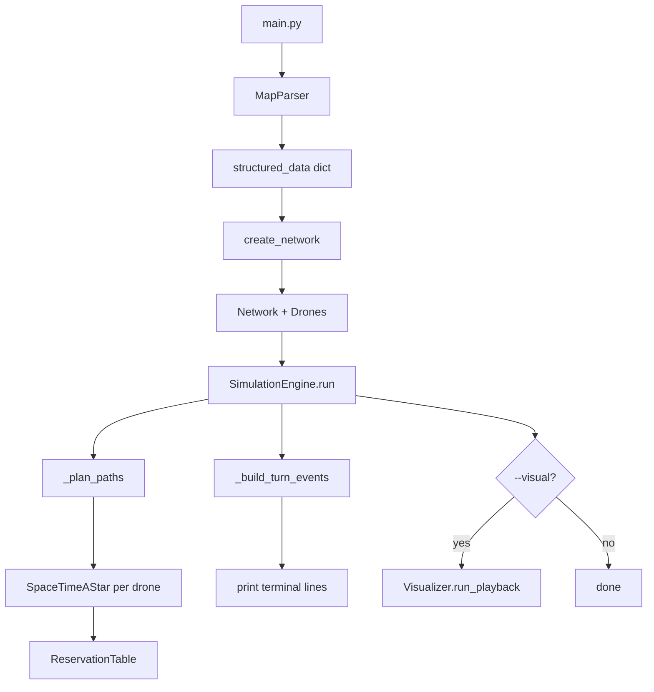

# How Fly-in Works

This document explains the full program flow starting from `main.py`, through parsing, pathfinding, simulation output, and optional visualization.

---

## Quick start

```bash
python3 main.py maps/easy/01_linear_path.txt          # terminal only
python3 main.py maps/easy/01_linear_path.txt --visual # + pygame playback
make run MAP=maps/medium/01_dead_end_trap.txt
make run-visual
```

---

## High-level pipeline



---

## 1. Entry point — `main.py`

`main.py` is the only script you run. It does four things:

1. **Parse CLI arguments**
   - `map_file` (required): path to a map (`.txt` under `maps/`)
   - `--visual` (optional): open the pygame viewer after planning

2. **Parse the map file** → `MapParser(map_file).run()`

3. **Build the graph** → `create_network(parser.structured_data)`

4. **Run the simulation** → `SimulationEngine(network, nb_drones, visualizer).run()`

Any exception prints `Error: …` to stderr and exits with code 1.

```text
main.py
  ├── MapParser          (src/parser/map_parser.py)
  ├── create_network     (src/parser/network_factory.py)
  └── SimulationEngine   (src/simulation/engine.py)
        └── Visualizer?  (src/visuals/visualizer.py, only with --visual)
```

---

## 2. Map parsing — `MapParser`

**File:** `src/parser/map_parser.py`

The parser reads the map line by line in **three phases**. Any error raises `ValueError` with a **line number** so the program stops immediately (subject requirement).

### Phase 1 — `parse_phase_one()`

- Ignores empty lines and lines starting with `#`
- Splits each line on the first `:` into `prefix` and `value`
- Recognized prefixes:
  - `nb_drones` — fleet size (once only, positive integer)
  - `start_hub` / `end_hub` / `hub` — zone definitions
  - `connection` — link between two zones

**Rules enforced here:**

| Rule | Behavior |
|------|----------|
| Connections | Both zone names must already appear above in the file |
| Duplicate edges | `A-B` and `B-A` are treated as the same link and rejected |
| Global | Exactly one `start_hub`, one `end_hub`, one `nb_drones` |

Raw strings are stored with their source line number for error messages.

### Phase 2 — `parse_phase_two()`

- Splits hub lines into `name`, `x`, `y`, optional metadata string
- Splits connection lines into `node_a`, `node_b`, optional metadata
- Detects duplicate zone names
- Builds `structured_data`:

```python
{
    "nb_drones": "3",
    "zones": {
        "start": {"role": "start", "x": "0", "y": "0", "metadata": "[color=green]", "line": 4},
        ...
    },
    "connections": [
        {"node_a": "start", "node_b": "junction", "metadata": "", "line": 9},
        ...
    ],
}
```

### Phase 3 — `handle_metadata()`

- Parses `[key=value ...]` blocks with regex
- **Zone keys allowed:** `zone`, `max_drones`, `color`
- **Connection keys allowed:** `max_link_capacity`
- Invalid keys or syntax → error with line number

---

## 3. Network building — `create_network()`

**File:** `src/parser/network_factory.py`

The structured dict is converted into validated **Pydantic models**, then into runtime **OOP objects**:

| Layer | Types | Role |
|-------|--------|------|
| Validation | `NetworkModel`, `ZoneModel`, `ConnectionModel` | Types, capacities, unique coords, no self-loops |
| Runtime | `Network`, `Zone`, `Connection`, `Drone` | What the simulation actually uses |

**`Network`** (`src/models/network.py`):

- `zones`: dict of zone name → `Zone`
- `connections`: list of `Connection` (bidirectional links)
- `start_zone` / `end_zone`: references set from hub `role`
- `drones`: `nb_drones` instances of `Drone`, all starting at `start_zone`
- `get_neighbors(zone)` / `get_connection(zone_a, zone_b)` for the graph

**`Zone`** (`src/models/zone.py`):

- Coordinates `x`, `y`
- `z_type`: `normal`, `blocked`, `restricted`, `priority`
- `max_drones` (default 1)
- Optional `color` for drawing

**`Drone`** (`src/models/drone.py`):

- `drone_id`: `"1"`, `"2"`, … (printed as `D1`, `D2` in output)

No `networkx` or similar — the graph is hand-rolled lists and dicts.

---

## 4. Simulation — `SimulationEngine`

**File:** `src/simulation/engine.py`

`run()` orchestrates planning, terminal output, and optional playback.

### 4.1 Path planning — `_plan_paths()`

For **each drone**, in order (D1, then D2, …):

1. Call `SpaceTimeAStar.find_path(start, end, start_turn)`
2. If no path, increment `start_turn` (drone waits longer at start) and retry (up to 200)
3. On success, `res_table.reserve_path(path)` so later drones avoid conflicts
4. Store path in `drone_paths[drone_id]`

A path is a list of **(zone_name, arrival_turn)** snapshots, e.g.:

```text
[("start", 0), ("junction", 1), ("goal", 3)]
```

Same zone twice in a row means **waiting** (e.g. `("start", 0), ("start", 1)`).

### 4.2 Turn events — `_build_turn_events()`

Paths are converted into **subject output tokens** per simulation turn:

| Movement | Turn delta | Output |
|----------|------------|--------|
| Normal / priority zone | 1 | `D<ID>-<zone>` on arrival turn |
| Restricted zone | 2 | `D<ID>-<zoneA-zoneB>` on transit turn, then `D<ID>-<zone>` on arrival |

Example line (turn 2):

```text
D1-goal D2-waypoint2
```

### 4.3 Terminal output

- Prints one line per turn `1 … max_turn` when something moves
- Prints summary comments: total turns, average per drone
- Drones that reached `end_hub` are no longer tracked after that (handled implicitly by paths ending at goal)

### 4.4 Visualization frames — `_build_frames()`

If `--visual` was passed, the engine precomputes **every turn’s drone positions** for the UI:

- Turn `0`: initial layout at start
- Later turns: zone name, or `zoneA-zoneB` while crossing a restricted link

Then:

```python
visualizer.load_playback(frames, events, max_turn)
visualizer.run_playback()  # blocks until window closed
```

---

## 5. Pathfinding — `SpaceTimeAStar`

**File:** `src/algorithm/pathfinder.py`

Search happens in **(zone, turn)** space, not just geography.

### Heuristic — backward Dijkstra

From `end_hub`, walk the graph backward. Cost to enter a zone:

- `normal`: 1 turn
- `restricted`: 2 turns
- `priority`: 0.9 (slightly preferred)
- `blocked`: skipped

Result: `h_scores[zone]` ≈ minimum turns remaining to goal.

### A* expansion

From `(start_zone, start_turn)`, two actions:

1. **Wait** — stay in zone, turn + 1 (if zone has capacity)
2. **Move** — go to a neighbor:
   - Destination `blocked` → skip
   - Cost 1 turn for `normal` / `priority`, **2 turns** for `restricted`
   - Check zone capacity at **arrival** turn
   - Check **connection** capacity on the transit turn (`current_turn + 1`)

Returns the first path that reaches `end_hub`, or `[]` if none within the turn limit.

---

## 6. Conflict avoidance — `ReservationTable`

**File:** `src/algorithm/reservation_table.py`

Shared by all drones during planning. Counts how many drones occupy each zone and connection **per turn**.

| Case | Capacity rule |
|------|----------------|
| `start_hub` at turn 0 | Unlimited (all drones spawn together) |
| `end_hub` | Unlimited arrivals |
| Other zones | `usage[turn][zone] < max_drones` |
| Connections | `usage[turn][link] < max_link_capacity` |

`reserve_path()` marks every zone visit and connection transit along a planned path so the next drone’s A* sees those slots as taken.

---

## 7. Visualization (optional)

**Files:**

- `src/visuals/visualizer.py` — pygame window, graph, drones, control bar
- `src/visuals/text_render.py` — text via Pillow (pygame.font is unreliable on Python 3.14)

### Flow

1. `main.py` creates `Visualizer(network)` only with `--visual`
2. After terminal output, engine passes precomputed `frames` and `turn_events`
3. `run_playback()` loops at 60 FPS; user steps through turns

### Controls

| Input | Action |
|-------|--------|
| ◀ / ▶ buttons | Previous / next turn |
| ⏮ / ⏭ | First / last turn |
| ← / → / Home / End / Space | Same as buttons |

### Drawing

- Zones: circles, optional color from map metadata
- Drones: gold circles with **numeric ID** (1, 2, 3…)
- Restricted transit: drone drawn at **midpoint** of the connection
- Bottom bar: turn counter, movements this turn, progress bar

---

## 8. Project layout

```text
Fly-in/
├── main.py                 # Entry point
├── maps/                   # Test maps (easy / medium / hard / challenger)
├── en.subject.pdf          # 42 subject
├── how_it_works.md         # This file
├── parsing.md              # Parser checklist
├── todo.md                 # Project checklist
│
└── src/
    ├── parser/
    │   ├── map_parser.py       # 3-phase .map parser
    │   └── network_factory.py  # Dict → validated models → Network
    ├── models/
    │   ├── zone.py
    │   ├── connection.py
    │   ├── drone.py
    │   └── network.py
    ├── algorithm/
    │   ├── pathfinder.py       # SpaceTimeAStar
    │   └── reservation_table.py
    ├── simulation/
    │   └── engine.py           # Plan, print, playback data
    └── visuals/
        ├── visualizer.py
        └── text_render.py
```

---

## 9. Map file format (minimal example)

```text
nb_drones: 2

start_hub: start 0 0 [color=green]
hub: waypoint1 1 0 [zone=normal]
end_hub: goal 3 0 [color=red]

connection: start-waypoint1
connection: waypoint1-goal
```

See `maps/README.md` for difficulty tiers and benchmarks.

---

## 10. Subject rules the code respects

- **Movement cost** is based on the **destination** zone type
- **Restricted** moves take 2 turns; drone occupies the **connection** on the middle turn
- **Capacities** on zones and links are enforced per turn via the reservation table
- **Output format**: `D<ID>-<zone>` or `D<ID>-<connection>` per moving drone per turn
- **Scoring**: fewer total turns is better (printed at the end)

---

## Related docs

| File | Contents |
|------|----------|
| `parsing.md` | Parser requirements checklist |
| `parsing_changes.md` | Parser implementation notes |
| `todo.md` | Feature / phase completion tracker |
| `README.md` | 42 README template, install, run commands |
